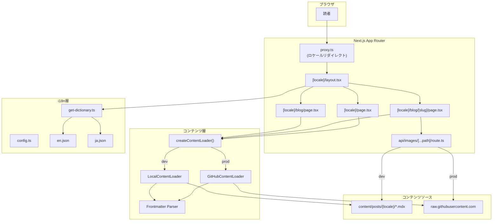
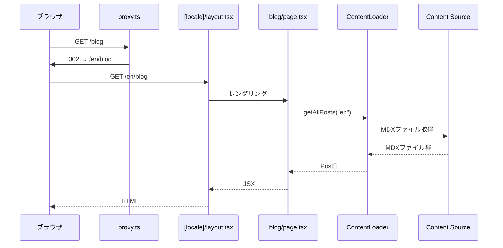

# 設計書: MDXブログサイト

## 概要

Next.js 16 App RouterとMDXを使用したブログサイトの設計。コンテンツレベルのi18n（英語・日本語）、Strategy patternによるコンテンツローダー（ローカル/GitHub）、タグフィルタリング、画像プロキシ、SEOメタデータ生成を実装する。

本システムは以下の主要な設計方針に基づく:

1. **Strategy Pattern によるコンテンツ取得の抽象化**: 開発環境（ローカルファイル）と本番環境（GitHub API）で異なるコンテンツソースを透過的に切り替える
2. **コンテンツレベルi18n**: フレームワークレベルのi18nではなく、ロケール別ディレクトリ（`content/posts/en/`, `content/posts/ja/`）によるコンテンツ管理
3. **サーバーサイドレンダリング**: `next-mdx-remote-client/rsc`を使用したRSCベースのMDXレンダリング
4. **軽量デプロイ**: Dockerイメージにコンテンツを含めず、ランタイムにGitHubからフェッチ

### 技術スタック

| カテゴリ | 技術 |
|---------|------|
| フレームワーク | Next.js 16 (App Router, canary) |
| 言語 | TypeScript 6.x |
| ランタイム | Bun |
| スタイリング | Tailwind CSS v4, Geistフォント |
| MDX | `@next/mdx`, `next-mdx-remote-client`, `remark-gfm`, `remark-toc` |
| リンター/フォーマッター | Biome |
| テスト | `bun:test`, fast-check (PBT), Playwright (E2E) |
| デプロイ | Docker + AWS Lambda (`aws-lambda-adapter`) |

## アーキテクチャ

### システム全体構成



### ディレクトリ構成

```
app/
├── [locale]/
│   ├── layout.tsx          # ロケール別レイアウト（ヘッダー・フッター）
│   ├── page.tsx            # トップページ
│   └── blog/
│       ├── page.tsx        # 記事一覧（タグフィルタリング対応）
│       └── [slug]/
│           └── page.tsx    # 個別記事ページ
├── api/
│   └── images/
│       └── [...path]/
│           └── route.ts    # 画像プロキシAPI
├── layout.tsx              # ルートレイアウト（children passthrough）
├── page.tsx                # ルート → /en リダイレクト
└── globals.css

components/
├── header.tsx              # ヘッダー（ナビ・言語切替）
└── footer.tsx              # フッター

lib/
├── content/
│   ├── types.ts            # Frontmatter, Post 型定義
│   ├── frontmatter.ts      # フロントマター解析・バリデーション
│   ├── loader.ts           # ContentLoader インターフェース・ファクトリ
│   ├── local-loader.ts     # ローカルファイルローダー
│   └── github-loader.ts    # GitHub APIローダー
└── i18n/
    ├── config.ts           # ロケール設定（既存）
    ├── get-dictionary.ts   # 辞書取得（既存）
    └── dictionaries/
        ├── en.json         # 英語辞書（既存）
        └── ja.json         # 日本語辞書（既存）

content/
├── posts/
│   ├── en/                 # 英語記事
│   │   └── *.mdx
│   └── ja/                 # 日本語記事
│       └── *.mdx
└── images/                 # 画像ファイル

test/
└── app/
    ├── content/            # コンテンツ関連テスト
    └── i18n/               # i18n関連テスト
```

### リクエストフロー



## コンポーネントとインターフェース

### ContentLoader インターフェース（Strategy Pattern）

```typescript
// lib/content/loader.ts
interface ContentLoader {
  /** 指定ロケールの全スラッグを取得 */
  getPostSlugs(locale: Locale): Promise<string[]>

  /** 指定ロケール・スラッグの記事を取得 */
  getPost(locale: Locale, slug: string): Promise<Post | null>

  /** 指定ロケールの全記事を取得（日付降順ソート済み） */
  getAllPosts(locale: Locale): Promise<Post[]>
}
```

**設計判断**: Strategy Patternを採用し、環境変数`CONTENT_SOURCE`（`"local"` | `"github"`）でローダーを切り替える。ファクトリ関数`createContentLoader()`が適切な実装を返す。これにより、テスト時にもモックローダーを注入しやすくなる。

### LocalContentLoader

```typescript
// lib/content/local-loader.ts
class LocalContentLoader implements ContentLoader {
  private basePath: string // default: "content/posts"

  async getPostSlugs(locale: Locale): Promise<string[]>
  async getPost(locale: Locale, slug: string): Promise<Post | null>
  async getAllPosts(locale: Locale): Promise<Post[]>
}
```

- `fs.readdir`で`content/posts/{locale}/`内の`.mdx`ファイルを列挙
- ファイル名から拡張子を除いたものをスラッグとして使用
- `gray-matter`または`vfile-matter`でフロントマターを解析

### GitHubContentLoader

```typescript
// lib/content/github-loader.ts
class GitHubContentLoader implements ContentLoader {
  private owner: string      // GITHUB_OWNER
  private repo: string       // GITHUB_REPO
  private branch: string     // GITHUB_BRANCH
  private contentPath: string // GITHUB_CONTENT_PATH

  async getPostSlugs(locale: Locale): Promise<string[]>
  async getPost(locale: Locale, slug: string): Promise<Post | null>
  async getAllPosts(locale: Locale): Promise<Post[]>
}
```

- GitHub REST API（`https://api.github.com/repos/{owner}/{repo}/contents/{path}`）でディレクトリ一覧を取得
- `raw.githubusercontent.com/{owner}/{repo}/{branch}/{path}`で個別ファイルをフェッチ
- Next.jsの`fetch`に`{ next: { revalidate: 3600 } }`を設定してキャッシュを活用

### Frontmatter Parser

```typescript
// lib/content/frontmatter.ts
function parseFrontmatter(raw: string): { frontmatter: Frontmatter; content: string }
function validateFrontmatter(data: unknown): Frontmatter  // throws on invalid
function serializeFrontmatter(fm: Frontmatter): string
```

- YAMLフロントマターの解析には`yaml`パッケージ（既にnode_modulesに存在）を使用
- バリデーションは必須フィールド（title, date, description, tags）の存在と型チェック

### MDXレンダリング

個別記事ページでは`next-mdx-remote-client/rsc`の`MDXRemote`コンポーネントを使用:

```typescript
import { MDXRemote } from "next-mdx-remote-client/rsc"
import { useMDXComponents } from "@/mdx-components"

// blog/[slug]/page.tsx 内
<MDXRemote
  source={post.content}
  options={{
    mdxOptions: {
      remarkPlugins: [remarkGfm],
    },
  }}
  components={useMDXComponents()}
/>
```

**設計判断**: `@next/mdx`はファイルベースのMDXルーティング用であり、動的にフェッチしたMDXコンテンツのレンダリングには`next-mdx-remote-client`を使用する。RSC対応の`/rsc`エントリポイントを使用することで、サーバーコンポーネント内で直接レンダリングできる。

### 画像プロキシ

```typescript
// app/api/images/[...path]/route.ts
export async function GET(
  request: Request,
  { params }: { params: Promise<{ path: string[] }> }
): Promise<Response>
```

- 開発環境: `content/images/{path}`からローカルファイルを読み込み
- 本番環境: `raw.githubusercontent.com/{owner}/{repo}/{branch}/content/images/{path}`からフェッチ
- Content-Typeはファイル拡張子から推定

### UIコンポーネント

```typescript
// components/header.tsx
function Header({ locale, dictionary }: { locale: Locale; dictionary: Dictionary }): JSX.Element

// components/footer.tsx
function Footer({ dictionary }: { dictionary: Dictionary }): JSX.Element
```

ヘッダーには:
- サイト名
- ナビゲーションリンク（ホーム、ブログ）
- 言語切り替えリンク（現在のパスのロケール部分を切り替え）

## データモデル

### Frontmatter型

```typescript
// lib/content/types.ts
interface Frontmatter {
  title: string        // 記事タイトル
  date: string         // ISO 8601形式の日付文字列 (e.g. "2025-01-15")
  description: string  // 記事の説明文
  tags: string[]       // タグの配列 (e.g. ["nextjs", "react"])
}
```

### Post型

```typescript
// lib/content/types.ts
interface Post {
  slug: string           // ファイル名から拡張子を除いたもの
  locale: Locale         // "en" | "ja"
  frontmatter: Frontmatter
  content: string        // フロントマターを除いたMDXコンテンツ本文
}
```

### MDXファイル構造

```yaml
---
title: "Getting Started with Next.js"
date: "2025-01-15"
description: "A guide to building modern web apps with Next.js"
tags: ["nextjs", "react", "typescript"]
---

MDX content here...
```

### 環境変数

| 変数名 | 説明 | デフォルト |
|--------|------|-----------|
| `CONTENT_SOURCE` | コンテンツソース (`"local"` \| `"github"`) | `"local"` |
| `GITHUB_OWNER` | GitHubリポジトリオーナー | - |
| `GITHUB_REPO` | GitHubリポジトリ名 | - |
| `GITHUB_BRANCH` | GitHubブランチ名 | `"main"` |
| `GITHUB_CONTENT_PATH` | コンテンツのルートパス | `"content"` |

### Translation Pair の検出

同一スラッグが複数のロケールディレクトリに存在する場合、それらはTranslation Pairとして扱われる。検出ロジック:

```typescript
async function getTranslationPair(
  loader: ContentLoader,
  currentLocale: Locale,
  slug: string
): Promise<Locale | null> {
  // 他のロケールに同一スラッグが存在するか確認
  for (const locale of locales) {
    if (locale === currentLocale) continue
    const post = await loader.getPost(locale, slug)
    if (post) return locale
  }
  return null
}
```


## 正当性プロパティ (Correctness Properties)

*プロパティとは、システムのすべての有効な実行において真であるべき特性や振る舞いのことである。プロパティは、人間が読める仕様と機械が検証可能な正当性保証の橋渡しとなる。*

### Property 1: フロントマターラウンドトリップ一貫性

*任意の*有効なFrontmatterオブジェクトに対して、そのオブジェクトをYAML文字列にシリアライズし、再度パースした結果は元のオブジェクトと等価である。

**検証対象: 要件 2.1, 2.5**

### Property 2: 必須フィールド欠落検出

*任意の*Frontmatterオブジェクトにおいて、必須フィールド（title, date, description, tags）のうち1つ以上が欠落している場合、バリデーション関数はエラーを返す。

**検証対象: 要件 2.2, 2.3**

### Property 3: スラッグ一意性

*任意の*ロケールに対して、`getPostSlugs`が返すスラッグのリストには重複が存在しない。

**検証対象: 要件 1.5**

### Property 4: ロケール分離性

*任意の*ロケールに対して、`getAllPosts`が返すすべての記事のlocaleフィールドは、リクエストされたロケールと一致する。

**検証対象: 要件 1.6, 13.9**

### Property 5: MDXコンポーネント完全性

*任意の*標準HTML要素名のセット（h1, h2, h3, h4, p, ul, ol, li, pre, code, a, img, blockquote, table, th, td）に対して、MDXコンポーネントマップに対応するコンポーネントが定義されている。

**検証対象: 要件 6.1**

### Property 6: 日付降順ソート

*任意の*記事リストに対して、日付でソートした結果の各隣接ペアにおいて、前の記事の日付は後の記事の日付以上である。

**検証対象: 要件 3.3**

### Property 7: タグフィルタリング正確性

*任意の*タグと*任意の*記事リストに対して、そのタグでフィルタリングした結果のすべての記事は、そのタグをtagsフィールドに含む。

**検証対象: 要件 5.1**

### Property 8: フィルタリング後ソート保持

*任意の*タグと*任意の*ソート済み記事リストに対して、タグフィルタリング後の結果も日付の降順ソートが維持される。

**検証対象: 要件 5.5**

### Property 9: ナビゲーションリンク整合性

*任意の*ロケールに対して、生成されるナビゲーションリンク（ホーム、ブログ）のパスは`/{locale}`で始まる正しいロケールプレフィックスを含む。

**検証対象: 要件 7.2, 13.2**

### Property 10: メタデータ生成一貫性

*任意の*有効なFrontmatterに対して、`generateMetadata`が生成するメタデータのtitleはFrontmatterのtitleと一致し、descriptionはFrontmatterのdescriptionと一致する。

**検証対象: 要件 4.6, 9.2**

### Property 11: 翻訳ペア対称性

*任意の*スラッグに対して、ロケールAからロケールBへのTranslation Pairが検出される場合、ロケールBからロケールAへのTranslation Pairも検出される。

**検証対象: 要件 4.7, 13.7**

### Property 12: 最新記事件数上限

*任意の*記事リストに対して、トップページ用に取得される最新記事の件数は5件以下である。

**検証対象: 要件 8.2**

### Property 13: 画像パス解決一貫性

*任意の*画像パス文字列に対して、画像プロキシのパス解決関数が返すURLは有効なURL形式（`/api/images/`プレフィックスを含む）である。

**検証対象: 要件 11.4**

### Property 14: ロケールリダイレクト正確性

*任意の*ロケールプレフィックスを持たないパスに対して、リダイレクト先のURLはデフォルトロケール（`en`）をプレフィックスとして付加したパスである。

**検証対象: 要件 13.10**

## エラーハンドリング

### コンテンツ取得エラー

| エラー状況 | 対応 |
|-----------|------|
| MDXファイルが見つからない | `getPost`が`null`を返し、ページコンポーネントが`notFound()`を呼び出して404を返す |
| フロントマターの必須フィールド欠落 | `validateFrontmatter`がエラーをスローし、ビルド時/リクエスト時にエラーログを出力 |
| GitHub APIフェッチ失敗 | エラーをログに出力し、`null`または空配列を返す。Next.jsのキャッシュにより前回の成功レスポンスが利用される場合がある |
| GitHub APIレート制限 | エラーログを出力。`next.revalidate`によるキャッシュで頻度を抑制 |
| 不正なYAMLフロントマター | パースエラーをキャッチし、エラーメッセージとファイルパスをログに出力 |

### 画像プロキシエラー

| エラー状況 | 対応 |
|-----------|------|
| 画像ファイルが見つからない | 404レスポンスを返す |
| GitHubからの画像フェッチ失敗 | 502レスポンスを返し、エラーをログに出力 |
| 不正なパス（ディレクトリトラバーサル等） | 400レスポンスを返す |

### i18nエラー

| エラー状況 | 対応 |
|-----------|------|
| 無効なロケール | `proxy.ts`でデフォルトロケールにリダイレクト |
| 翻訳辞書のキー欠落 | TypeScriptの型チェックでビルド時に検出 |

## テスト戦略

### テストフレームワーク構成

| 種別 | ツール | 実行コマンド |
|------|--------|-------------|
| ユニットテスト | `bun:test` + `happy-dom` | `bun test test/app --preload ./happydom.tsx` |
| プロパティベーステスト | `bun:test` + `fast-check` | 同上（テストファイル内でfast-checkを使用） |
| E2Eテスト | Playwright | `bun run test:e2e` |

### デュアルテストアプローチ

本プロジェクトでは、ユニットテストとプロパティベーステストの両方を使用する:

- **ユニットテスト**: 具体的な入力例、エッジケース、エラー条件の検証
  - 存在しないスラッグで404が返ること
  - GitHub APIフェッチ失敗時のエラーハンドリング
  - 空のコンテンツディレクトリでの動作
- **プロパティベーステスト**: ランダム生成された入力による普遍的プロパティの検証
  - 上記14のCorrectnessプロパティをそれぞれ1つのプロパティテストとして実装
  - 各テストは最低100回のイテレーションで実行

### プロパティベーステスト設定

- ライブラリ: `fast-check`
- 各プロパティテストは設計書のプロパティ番号を参照するコメントタグを含める
- タグ形式: `Feature: mdx-blog-site, Property {number}: {property_text}`
- 各Correctnessプロパティは1つのプロパティベーステストで実装する
- 最低100イテレーション（`fc.assert`のデフォルトまたは`numRuns: 100`を明示指定）

### テストファイル構成

```
test/app/
├── content/
│   ├── frontmatter.test.ts    # Property 1, 2
│   ├── loader.test.ts         # Property 3, 4
│   ├── sort-filter.test.ts    # Property 6, 7, 8
│   └── image-proxy.test.ts    # Property 13
├── components/
│   ├── mdx-components.test.ts # Property 5
│   └── header.test.tsx        # Property 9
├── pages/
│   ├── metadata.test.ts       # Property 10
│   ├── translation.test.ts    # Property 11
│   └── home.test.ts           # Property 12
├── i18n/
│   └── redirect.test.ts       # Property 14
├── page.test.tsx               # 既存
└── proxy.test.ts               # 既存
```

### E2Eテスト

Playwrightによるエンドツーエンドテストで以下を検証:
- ロケールリダイレクトの動作
- 記事一覧ページの表示と遷移
- タグフィルタリングのUI動作
- 言語切り替えの動作
- 404ページの表示
