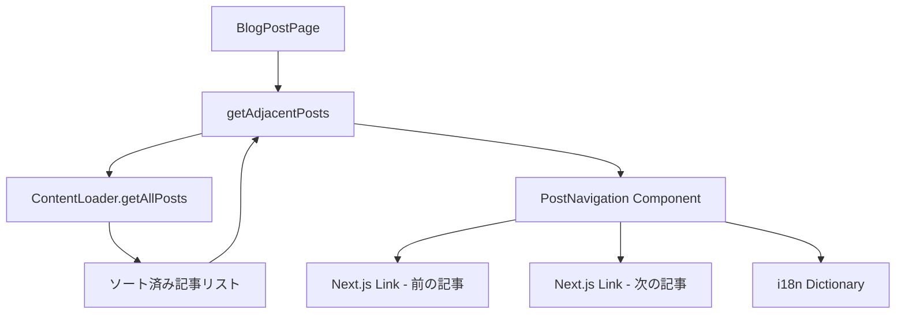
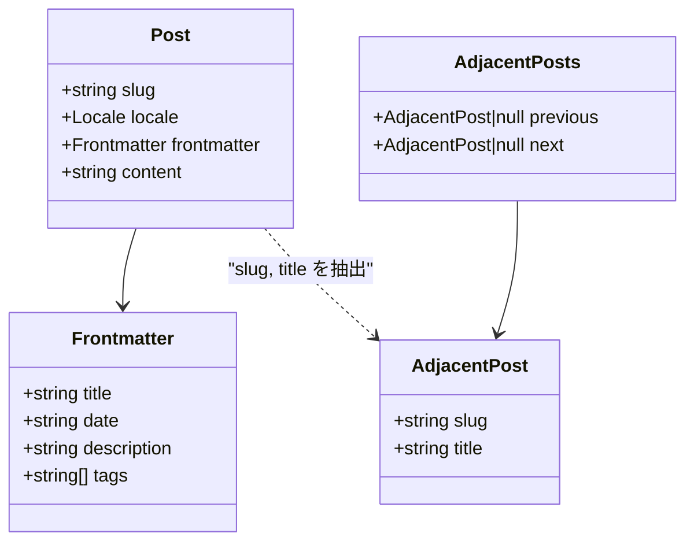

# 設計書: 記事ナビゲーション (post-navigation)

## 概要

ブログ記事ページの末尾に、前の記事・次の記事へのナビゲーションコンポーネントを追加する。記事は日付降順（新しい順）でソートされ、同一ロケール内の記事間でのみ遷移する。

本機能は以下の3つの変更で構成される:

1. **Content Loader の拡張**: 現在の記事の前後の記事情報を取得する関数を追加
2. **ナビゲーションコンポーネント**: 前後記事へのリンクを表示するReact Server Component
3. **i18n辞書の拡張**: ナビゲーションラベルの多言語テキストを追加

## アーキテクチャ

### 全体構成



### 設計方針

- **React Server Component**: ナビゲーションコンポーネントはサーバーコンポーネントとして実装し、`"use client"` は不要
- **既存のContentLoaderインターフェースを活用**: `getAllPosts` で取得済みのソート済みリストから前後記事を特定する純粋関数を追加
- **ContentLoaderインターフェースは変更しない**: 前後記事の特定ロジックは `lib/content/` 内のユーティリティ関数として実装し、既存の `ContentLoader` インターフェースには手を加えない
- **CSSベースのTruncation**: Tailwind CSSの `truncate` ユーティリティでタイトル切り詰めを実現


## コンポーネントとインターフェース

### 1. 前後記事取得関数: `getAdjacentPosts`

**ファイル**: `lib/content/adjacent.ts`

既存の `getAllPosts` が返すソート済み（日付降順）記事リストから、指定されたslugの前後の記事を特定する純粋関数。

```typescript
import type { Locale } from "@/lib/i18n/config"
import type { Post } from "./types"

export interface AdjacentPost {
  slug: string
  title: string
}

export interface AdjacentPosts {
  previous: AdjacentPost | null // 古い記事（リスト上で次のインデックス）
  next: AdjacentPost | null     // 新しい記事（リスト上で前のインデックス）
}

/**
 * ソート済み記事リストから指定slugの前後記事を取得する純粋関数。
 * posts は日付降順でソート済みであること。
 */
export function findAdjacentPosts(
  posts: Post[],
  currentSlug: string,
): AdjacentPosts
```

**ロジック**:
- `posts` 配列（日付降順）から `currentSlug` に一致する記事のインデックスを検索
- `previous`（古い記事）= インデックス + 1 の記事（存在する場合）
- `next`（新しい記事）= インデックス - 1 の記事（存在する場合）
- 該当記事が見つからない場合は `{ previous: null, next: null }` を返す

### 2. ナビゲーションコンポーネント: `PostNavigation`

**ファイル**: `components/post-navigation.tsx`

```typescript
import type { Locale } from "@/lib/i18n/config"
import type { AdjacentPosts } from "@/lib/content/adjacent"
import type { Dictionary } from "@/lib/i18n/get-dictionary"

interface PostNavigationProps {
  locale: Locale
  adjacentPosts: AdjacentPosts
  dictionary: Dictionary
}

export function PostNavigation({
  locale,
  adjacentPosts,
  dictionary,
}: Readonly<PostNavigationProps>): JSX.Element | null
```

**振る舞い**:
- `previous` と `next` の両方が `null` の場合、`null` を返す（何も表示しない）
- 存在するリンクのみ表示し、`Next.js Link` コンポーネントで `/{locale}/blog/{slug}` へ遷移
- タイトルは CSS `truncate`（`text-overflow: ellipsis`）で1行に切り詰め
- ラベルテキスト（「前の記事」「次の記事」）は辞書から取得

### 3. i18n辞書の拡張

**ファイル**: `lib/i18n/dictionaries/en.json` / `ja.json`

`blog` セクションに以下のキーを追加:

```json
{
  "blog": {
    "previousPost": "Previous Post",
    "nextPost": "Next Post"
  }
}
```

```json
{
  "blog": {
    "previousPost": "前の記事",
    "nextPost": "次の記事"
  }
}
```

### 4. ブログ記事ページの統合

**ファイル**: `app/[locale]/blog/[slug]/page.tsx`

`BlogPostPage` コンポーネント内で:
1. `getAllPosts` でソート済み記事リストを取得
2. `findAdjacentPosts` で前後記事を特定
3. `<PostNavigation>` を `<article>` の直後に配置

## データモデル

### AdjacentPost

| フィールド | 型 | 説明 |
|---|---|---|
| `slug` | `string` | 記事のスラッグ（URLパス） |
| `title` | `string` | 記事のタイトル |

### AdjacentPosts

| フィールド | 型 | 説明 |
|---|---|---|
| `previous` | `AdjacentPost \| null` | 前の記事（古い記事）。最も古い記事の場合は `null` |
| `next` | `AdjacentPost \| null` | 次の記事（新しい記事）。最も新しい記事の場合は `null` |

### 既存型との関係



`AdjacentPost` は `Post` の軽量版であり、ナビゲーションに必要な `slug` と `title` のみを保持する。`findAdjacentPosts` 関数が `Post[]` から `AdjacentPosts` への変換を担う。


## 正当性プロパティ

*プロパティとは、システムの全ての有効な実行において真であるべき特性や振る舞いのことです。人間が読める仕様と機械的に検証可能な正当性保証の橋渡しとなる、形式的な記述です。*

### Property 1: 前後記事の正確な特定

*任意の*日付降順でソートされた記事リストと、そのリスト内の任意のslugに対して、`findAdjacentPosts` は以下を返すべきである:
- `previous`（古い記事）: 現在のインデックス + 1 の記事の `slug` と `title`（最後の記事の場合は `null`）
- `next`（新しい記事）: 現在のインデックス - 1 の記事の `slug` と `title`（最初の記事の場合は `null`）

**Validates: Requirements 1.1, 1.2, 1.3, 1.4**

### Property 2: 条件付きリンク表示

*任意の* `AdjacentPosts` に対して、`PostNavigation` コンポーネントは `previous` が非nullの場合にのみ「前の記事」リンクを表示し、`next` が非nullの場合にのみ「次の記事」リンクを表示するべきである。

**Validates: Requirements 2.2, 2.3, 2.4, 2.5**

### Property 3: リンクhrefの正確性

*任意の*ロケールと `AdjacentPosts`（少なくとも1つが非null）に対して、表示されるリンクの `href` は `/{locale}/blog/{slug}` の形式であるべきである。

**Validates: Requirements 4.1, 4.2**

### Property 4: ラベルテキストの辞書一致

*任意の*ロケールの辞書に対して、`PostNavigation` コンポーネントが表示するラベルテキストは、その辞書の `blog.previousPost` および `blog.nextPost` の値と一致するべきである。

**Validates: Requirements 5.1**

## エラーハンドリング

| シナリオ | 対応 |
|---|---|
| `currentSlug` が記事リストに存在しない | `findAdjacentPosts` は `{ previous: null, next: null }` を返す |
| 記事リストが空 | `findAdjacentPosts` は `{ previous: null, next: null }` を返す |
| 記事が1件のみ | `findAdjacentPosts` は `{ previous: null, next: null }` を返す |
| `previous` と `next` の両方が `null` | `PostNavigation` コンポーネントは `null` を返し、何も表示しない |

## テスト戦略

### ユニットテスト

**テストランナー**: Bun test + Happy DOM

#### `findAdjacentPosts` のユニットテスト

**ファイル**: `test/unit/lib/content/adjacent.test.ts`

- 記事リストの中間にある記事の前後取得
- 最初の記事（最新）の場合、`next` が `null`
- 最後の記事（最古）の場合、`previous` が `null`
- 記事が1件のみの場合、両方 `null`
- 空リストの場合、両方 `null`
- 存在しないslugの場合、両方 `null`

#### `PostNavigation` コンポーネントのユニットテスト

**ファイル**: `test/unit/components/post-navigation.test.tsx`

- 両方のリンクが存在する場合の表示確認
- `previous` のみ存在する場合の表示確認
- `next` のみ存在する場合の表示確認
- 両方 `null` の場合、何も表示されないことの確認
- CSS `truncate` クラスの適用確認
- Next.js `Link` コンポーネントの使用確認

### プロパティベーステスト

**ライブラリ**: `fast-check`
**テストランナー**: Bun test
**最小イテレーション数**: 100回

#### Property 1 テスト

**ファイル**: `test/unit/lib/content/adjacent.test.ts`
**タグ**: `Feature: post-navigation, Property 1: 前後記事の正確な特定`

ランダムな記事リスト（日付降順ソート済み）とランダムなslugを生成し、`findAdjacentPosts` の結果が配列のインデックスに基づく期待値と一致することを検証する。

#### Property 2 テスト

**ファイル**: `test/unit/components/post-navigation.test.tsx`
**タグ**: `Feature: post-navigation, Property 2: 条件付きリンク表示`

ランダムな `AdjacentPosts`（previous/nextがそれぞれnullまたは非null）を生成し、コンポーネントのレンダリング結果でリンクの有無が `AdjacentPosts` の状態と一致することを検証する。

#### Property 3 テスト

**ファイル**: `test/unit/components/post-navigation.test.tsx`
**タグ**: `Feature: post-navigation, Property 3: リンクhrefの正確性`

ランダムなロケールとslugを生成し、レンダリングされたリンクの `href` が `/{locale}/blog/{slug}` 形式であることを検証する。

#### Property 4 テスト

**ファイル**: `test/unit/components/post-navigation.test.tsx`
**タグ**: `Feature: post-navigation, Property 4: ラベルテキストの辞書一致`

ランダムなラベルテキストを含む辞書を生成し、コンポーネントが表示するラベルが辞書の値と一致することを検証する。

### E2Eテスト

**ファイル**: `test/e2e/post-navigation.test.ts`
**ツール**: Playwright

- 中間の記事ページで前後ナビゲーションリンクが表示されることを確認
- ナビゲーションリンクをクリックして正しい記事ページに遷移することを確認
- 最新記事で「次の記事」リンクが表示されないことを確認
- 最古記事で「前の記事」リンクが表示されないことを確認
- モバイルビューポートでの縦積みレイアウトを確認
- 日本語ロケールでラベルが日本語で表示されることを確認
